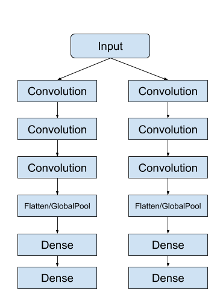
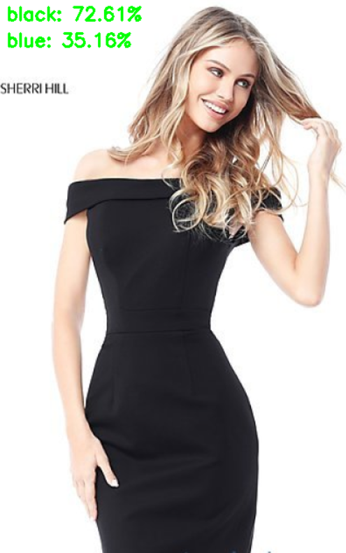
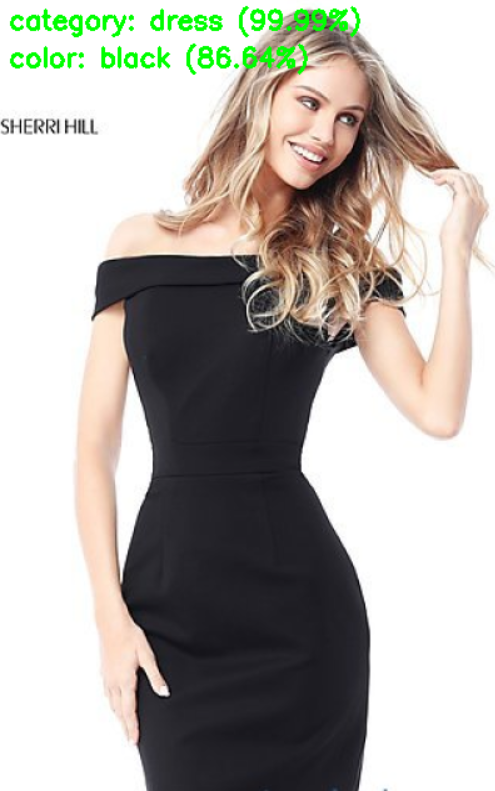

# Multi label model VS Multi output model

## Multi label model

In a **Multi label model**, there is only one output head. But this one output head can predict multiple labels.

Example:
Suppose we are training a neural network to classify cloths of different color. The cloths are:
  1. black jeans
  2. blue jeans
  3. blue dress
  4. red dress
  5. blue shirt
  6. red shirt
  7. black shoes
  
So three different colors(black, blue, red) and 4 different type of cloths(Jeans, shirt, dress, shoes).

When we train the multi label model,
  - Input: an image
  - Label: one hot array with length 7 (there is 3 different color and 4 different cloths type)

If the input is a 256x256 red shirt, then 
  - Input: 256x256x3
  - output: [0, 0, 1, 0, 1, 0, 0]
  
So basically multi label model is a kind of multi class classification with multiple output at a time.

## Multi output model

In a **Multi output model**, there are more than 1 output head and each head can predict one or more than one label.

As i have to classify two different type of class (color and cloth type) i use a 2 output head model.
  - one output head to predict the color of the cloths
  - another output head to predict the type of dress
 
Here is a demo pic of the model.

When we train the multi output model for our data
  - one branch will predict the color of the dress
  - another branch will predict the type of the cloths
 
We do not need any color information to classify the dress type. So when I input the image in the cloth type prediction branch, i convert the images from RGB to Gray scale.

So for **cloths type** prediction branch:
  - Input: a gray scale image (256x256)
  - Label: one hot array with length four (four type of cloths)
  
So for **color** prediction branch:
  - Input: a rgb scale image (256x256x3)
  - Label: one hot array with length three (three different colors)

<h3>Why we use Multi output model when Multi label model can perform the same task???</h3>

**The Ans is:**

Multi label model can only classify the combination which I use to train the model. That means, Multi label model can only identify  "black jeans", "blue jeans", "blue dress", "red dress", "blue shirt", "red shirt", "black shoes" classes. It can not identify **""black dress"** because there is no **black dress** class exist in the training classes.

On the other hand, Multi output model can identify **""black dress"**. 

The reason **Multi output model** can identify the **""black dress"** is, Multi output model learn cloth type and color separately. So Multi output model can identify any combination of four different dress and three different colors.

Here is an example:

Multi label model prediction|  Multi output model prediction
:--------------------------:|:-------------------------:
  |  

In the prediction images, Multi label model can not predict the **black dress** properly. Because, it never see anything like this.
But Multi output model can predict **black dress**. Because this model learn the cloths type and color separately
